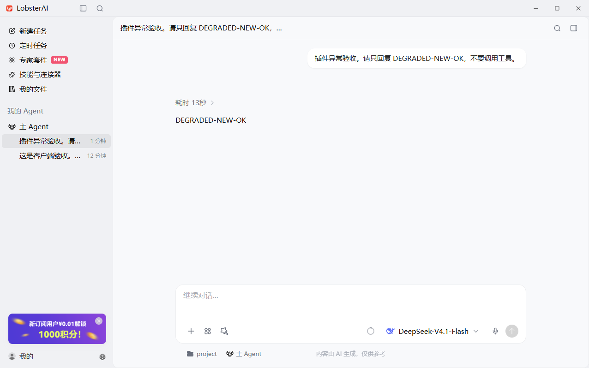
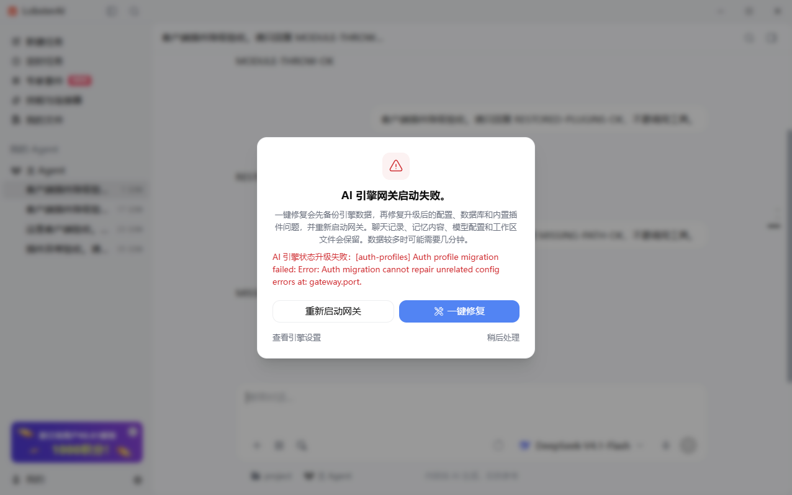

# OpenClaw 插件异常时降级启动

## 1. 概述

### 1.1 问题

从 `release/2026.9.23` 的 `8a478bffa6422e2b1bb2e428de916672b1b1c7a7` 开始实施。该分支仍固定 OpenClaw `v2026.8.1`。

用户安装的 `memory-tencentdb` 包缺少 TypeScript 入口对应的编译产物，日志还包含 OpenClaw host peer link 不可用。升级后的启动收敛尝试修复插件，修复失败的 warning 被提升为 `OpenClaw plugin verification failed; refusing to report the gateway ready.`，导致整个客户端无法对话。升级该插件能绕过本例，但不能覆盖其他插件或其他可用性故障。

### 1.2 根因

8.1 已有基于安装根目录的插件隔离机制，却仅豁免部分 payload smoke warning。其他修复 warning、缺安装路径的 active record 仍阻断启动。`plugins.load.paths` 检查失败还可能使校验与 Doctor 将暂时无法检查的配置误判为过期。配置修复 hook 若直接修改输入后抛异常，也没有事务式隔离。

LobsterAI 停止重启是在响应网关的明确拒绝；只取消宿主的重启抑制不能恢复服务。因此在固定版本的上游运行时边界回移策略，宿主继续遵守实际 ready 状态。

## 2. 用户场景

1. 安装包缺编译入口、缺 host link，或插件升级失败：保留安装记录、启用设置及配置，隔离无法加载的插件，健康模型仍可新建和继续会话。
2. 配置的插件目录暂未挂载、权限不足或 I/O 检查失败：展示可定位的 warning，保留路径和无法检查的插件、channel、模型配置。
3. 插件配置修复 hook 抛错：丢弃该 hook 的局部配置修改，继续处理其他插件。
4. 插件修复成功后重启：重新检查 payload，清除该次启动的隔离状态，恢复插件。
5. 核心配置不合法、迁移租约失效、迁移输入变化或状态迁移无法确认安全完成：仍拒绝启动，保留原有修复和重试流程。

## 3. 功能需求

- 按故障归属与生命周期阶段处理，不按插件名、安装来源或报错文本设置豁免名单。
- 插件不可用不等于允许执行损坏插件。继续使用已有 loader quarantine 和安全校验。
- 修复不成功时保留配置与安装记录，不自动卸载、清空配置或关闭所有插件。
- 缺失路径与检查失败分别报告诊断类型；保留原始系统错误码和修复提示。
- 启动 checkpoint 已有效的路径也要重新验证插件并重建隔离状态。
- 验收必须经过真实 Electron renderer、preload、主进程、网关和持久化会话；不能用模块测试替代客户端实操。

## 4. 实现方案

### 4.1 版本补丁

新增 `scripts/patches/v2026.8.1/zzz-openclaw-plugin-degraded-startup.patch`，在已有补丁之后应用。源代码开发使用独立 OpenClaw worktree，最终行为以版本补丁为准；不提交生成的 vendor 运行时。

- `runtime-degraded-state` 定义共用的 `configured-unavailable / warning` 策略。
- 启动收敛继续记录修复告警和执行 payload 校验，移除插件 warning 的全局拒绝分支，覆盖无安装路径的 active record。
- discovery 为配置路径的缺失与检查失败记录 `configDisposition: preserve`；缓存与 SQLite 安装索引保留诊断字段。
- 校验、自动启用和 Doctor 清理在发现未检查路径时保护输入。不得由其他插件解释、迁移或删除无法确认归属的配置。
- Doctor 注册插件检查失败时产生 availability finding，并屏蔽当前调用中的过期回调；下一次健康调用仍可恢复。已注册检查报告的数据错误和重复检查 ID 仍保留原有失败处理。
- 纯配置修复 hook 使用独立候选配置，抛错时丢弃候选；状态写入迁移不适用此捕获策略。

### 4.2 上游来源与升级清理

以下发布归属通过 GitHub 提交祖先关系核对；不能仅凭 PR 合并时间判断。

| 上游 | 合并提交 | 本次关系 | 后续清理条件 |
| --- | --- | --- | --- |
| [#110239](https://github.com/openclaw/openclaw/pull/110239) | `cd1ab406322bbd4a735a4473c1f47a2c53ebf992` | 8.1 已包含安装根目录隔离基础 | 保持 loader 的隔离能力 |
| [#150016](https://github.com/openclaw/openclaw/pull/150016) | `eb8bca1326c485c8c8bf75a2c242b06415a1b6af` | 回移启动与 Doctor 的共用可用性策略，按 8.1 Doctor 注册结构适配 | 9.5 已包含；升级并通过端侧回归后删除对应部分 |
| [#150312](https://github.com/openclaw/openclaw/pull/150312) | `7a15658f54a9a093af43c6d68627b946cb8cf392` | 回移缺失/不可读配置路径的告警及配置保护，适配 8.1 单体校验模块 | 9.5 已包含；保留路径与配置恢复验收后删除对应部分 |
| [#154543](https://github.com/openclaw/openclaw/pull/154543) | `47be91106c07bc957820dc5bb726433b99f38c8f` | 回移纯配置修复 hook 输入隔离；不是该 PR 全部更新 CLI 行为的逐字移植 | 9.5 不包含；升级目标须含此提交或等价实现 |
| [#147711](https://github.com/openclaw/openclaw/pull/147711) | `dac3cb6d47c2387442b3e50327fe6346af6d3232` | 迁移延期账本、ACP 来源保留及新配置读写协议的后续参考；不能将本补丁视为整个 PR 的移植 | 9.5 已包含；升级时核对迁移延期与账本完成状态 |

[v2026.9.5](https://github.com/openclaw/openclaw/releases/tag/v2026.9.5) 于 2026-09-19 发布。其 [更新故障文档](https://github.com/openclaw/openclaw/blob/v2026.9.5/docs/install/update-troubleshooting.md#plugin-repair-warnings) 描述插件修复告警、配置保护和可用网关继续运行。9.5 之后上游仍继续完善 Doctor 与安全迁移边界，如 [#155389](https://github.com/openclaw/openclaw/pull/155389)。未来不能仅因版本号大于 9.5 就无条件删除全部补丁。

本补丁不将 8.1 的状态迁移 warning 全部降级；迁移写入是否完成仍由现有迁移所有者和 checkpoint 决定。缺插件时未执行的插件 hook 与原始输入保留，恢复插件后应通过 Doctor 重新检查。完整的 9.5 延期账本涉及配置读写、会话来源和数据库协议，不能以吞掉异常冒充迁移完成。

已有 `zz-openclaw-marketplace-clone-retry.patch` 保留其获取阶段的类型化错误及重试逻辑，但其“无安装路径仍阻塞”等旧启动策略由本补丁取代。升级时应分别核对获取流程与启动策略，不应将两份补丁一起盲目保留。

### 4.3 验收方式

从当前分支编译客户端及打过完整版本补丁的 OpenClaw。使用独立 appData 和会话工作目录；测试插件、历史标记和日志均在隔离目录。通过 Electron remote debugging / CDP 操作真实客户端，使用 DOM 和 IPC 检查状态、发送消息、重启网关及查看持久化结果。不使用 computer-use，不注入全局键鼠事件。

故障对照采用用户提供的升级失败截图/日志和本机同类原始包的复现；本机另行验证健康基线、新会话和续聊、进程重启后会话保留、问题插件恢复，以及无效核心配置的反向用例。没有声称重新构建并实测未打补丁的旧版客户端。日志与截图在提交前去除访问令牌、真实账号标识及私人会话内容。

## 5. 边界情况

| 场景 | 处理 |
| --- | --- |
| 被隔离插件正是所选模型 provider | 网关可运行，该模型不可用；需选择健康模型 |
| 修复下载失败但旧插件仍通过校验 | 可继续使用旧插件并保留修复告警 |
| 未知路径下的插件所有者不能确定 | 保守保留相关配置，暂缓依赖该发现结果的自动修改 |
| 已存在用户显式禁用/拒绝设置 | 保留原设置，不因降级策略自动启用 |
| 核心 schema、SQLite 完整性或迁移锁错误 | 保持失败，不作插件可用性告警处理 |
| 运行中任意插件主动终止进程或破坏共享全局状态 | 不在启动隔离策略的保证范围；上游插件并非独立进程沙箱 |
| 插件迁移函数已经执行写入后抛错 | 保持迁移失败处理，不声称能够安全继续 |

## 6. 验收标准与结果

### 6.1 Electron 端侧验收（2026-09-23）

| 检查 | 实际结果 |
| --- | --- |
| 健康基线 | Electron 界面创建会话，已登录账号的套餐 `deepseek-flash-YoudaoInner` 返回 `BASELINE-PLUGIN-OK`，消息持久化成功 |
| 原始故障包 | 使用 npm 原始 `@tencentdb-agent-memory/memory-tencentdb@0.2.2`，未补造编译入口；网关日志实际出现 `Failed to update memory-tencentdb: package install requires compiled runtime output for TypeScript entry ./index.ts` |
| 故障后的新会话 | 网关达到 ready，界面发起新会话，真实套餐模型返回 `DEGRADED-NEW-OK` |
| 故障后的原会话 | 打开故障前的会话，续聊返回 `DEGRADED-CONTINUE-OK`；IPC 读取同时包含故障前后消息 |
| 配置与数据 | `enabled: true`、allowlist、`e2ePreserve` 配置及工作区历史标记均保留 |
| 最终运行时冷启动 | 完整重建源码、Gateway bundle 和启动 helper 后，退出并重新启动 Electron；原会话返回 `RESTART-CONTINUE-OK`，health 报告网关正常、仅故障插件不可用 |
| 安装记录没有路径 | `e2e-pathless` 的 active 安装记录不提供 `installPath`；真实 smoke check 报 `missing-install-path`，health 标记 `configured-unavailable`，新会话返回 `SECONDARY-FAILURES-OK` |
| 插件模块加载抛异常 | `e2e-returning` 的入口抛出 `E2E_PLUGIN_MODULE_THROW`，真实 loader 日志确认异常；网关继续 ready，新会话返回 `MODULE-THROW-OK` |
| 故障插件恢复 | 为以上两个模拟插件补齐路径及正常入口后冷启动，日志确认二者重新注册，health 的 loaded 包含二者、unavailable 仅剩原始 memory 插件，原会话返回 `RESTORED-PLUGINS-OK` |
| 配置路径缺失 | 添加不存在的 `plugins.load.paths` 路径和未知插件配置，通过客户端 IPC 重启；日志明确告警并保留输入，原会话返回 `MISSING-PATH-OK`；路径、未知插件的 enabled/allow/config 标记仍在 |
| 核心配置无效的反向用例 | 将 `gateway.port` 写为非法字符串，经真实重启返回 `success: false`，界面显示网关启动失败，错误明确定位到 `gateway.port`；非法字段没有被当作插件问题删除 |
| 核心配置恢复 | 只恢复 gateway.port 后客户端已有重试流程恢复网关；打开最初的基线会话续聊，返回 `CORE-RECOVERY-OK`，memory 插件仍隔离，历史与配置保留 |

原始包 SHA-256：`f4d5c764bd991bdd4827590416bace144c273d6f1b9ce9da52e9e6a5c1d0af46`。该包通过安装记录参与真实启动收敛与 payload smoke check，不 mock 网关、IPC、模型服务或会话存储。

本机证据目录：`%TEMP%/lobster-plugin-degraded-e2e-20260923`。隔离主日志与网关日志在该目录的 `appdata/LobsterAI/` 下。原始配置、登录凭据及完整日志不提交；提交的截图只包含本次合成验收会话，JSON 仅包含选定的诊断与断言结果。

17:02 最终经 preload IPC 重新读取四个会话：全部为 completed，九条验收回复均已持久化，模型元数据均为 `deepseek-flash-YoudaoInner`。详细结果见 [脱敏验收记录](evidence/acceptance.json)。

插件入口损坏时真实套餐模型仍完成回复：



核心配置错误仍被拒绝，恢复后原会话继续成功：



[插件恢复后的续聊截图](evidence/plugins-restored.png) · [核心配置恢复后的原会话截图](evidence/core-recovered.png)

缺失配置路径用例在运行中的隔离客户端修改 OpenClaw 配置，再通过正常 `restartGateway` IPC 重启。它验证上游的读取、诊断与保护策略；LobsterAI 全量 config sync 仍会管理 `plugins.load.paths`，不能据此推断客户端冷启动会永久保留任意手工添加的路径。

### 6.2 构建与回归

- LobsterAI `npm run compile:electron`、`npm run build` 已通过。
- OpenClaw `OPENCLAW_RUN_NODE_SKIP_DTS_BUILD=1 pnpm build` 已通过；重新生成 Gateway bundle 与四个启动/修复 helper。验收复用已有运行时的未变更生产依赖；未制作安装包。
- 全新 `v2026.8.1` checkout 上完整 57 个版本补丁已重复应用成功；最终补丁输出与开发源树的 47 个修改文件逐一一致。
- 修改的上游文件通过 `oxlint`、`oxfmt --check` 和核心 `tsgo`。`tsgo:prod` 的扩展阶段仍有既有 `extensions/openai/openai-provider.ts:170` 的 `lobsterai-model-compat` 类型错误；本补丁不修改该接口。
- 启动 checkpoint、迁移拒绝边界、插件修复 warning、Doctor 配置保护、纯配置 hook 回滚、Doctor 检查注册隔离及索引诊断持久化的定向测试已通过。Doctor lint 25 例已完整重跑通过；插件路径/索引定向测试 12 例通过，1 例 POSIX 权限测试在 Windows 跳过。两例 chmod-000 Doctor 测试同样在 Windows 跳过。
- 配置校验相关 150 例通过、1 例跳过；LobsterAI 补丁登记测试 19 例及其改动文件 ESLint 通过。真实权限拒绝未在 Windows 端侧模拟，错误码分流由定向测试覆盖。
- [PR #2754](https://github.com/netease-youdao/LobsterAI/pull/2754) 的 `44d2fa3c3` 提交已通过 [GitHub CI](https://github.com/netease-youdao/LobsterAI/actions/runs/35839220721)：全量测试 5550 例通过、163 例跳过，主进程构建、lint、安全及补丁校验通过。运行时补丁路径已纳入 main CI 条件，避免仅文档/脚本分类导致主进程测试跳过。

### 6.3 复验入口

`scripts/e2e-openclaw-plugin-degraded.cjs` 连接已用独立 appData 启动的真实 Electron。启动时指定 renderer 调试端口 `--remote-debugging-port=19533` 和 main 调试端口 `--inspect=19534`。仅在隔离测试配置中注入插件故障；实际登录账号通过客户端正常登录，不在命令行传密钥。

```powershell
node scripts/e2e-openclaw-plugin-degraded.cjs send --port 19533 --output <证据目录> --name broken-new --marker DEGRADED-NEW-OK
node scripts/e2e-openclaw-plugin-degraded.cjs send --port 19533 --output <证据目录> --name broken-continue --marker DEGRADED-CONTINUE-OK --session <原会话ID>
node scripts/e2e-openclaw-plugin-degraded.cjs restart --port 19533 --output <证据目录> --name restart
node scripts/e2e-openclaw-plugin-degraded.cjs capture --port 19533 --output <证据目录> --name result
node scripts/e2e-openclaw-plugin-degraded.cjs stop --port 19534
```

驱动通过 DOM 填写提示词和 CDP 发送 Enter，使用真实 preload IPC 读取最终回复并断言持久化结果及会话完成状态；输出会话 ID、引擎状态和截图。模型元数据可能晚于完成事件到达，因此即时结果中的 model 可为 null；最终持久化消息和真实 provider 日志用于核对套餐模型。停止命令触发应用自身的 SIGTERM 清理流程，避免退出确认对话框妨碍自动化。

复现注入方法（只对隔离 profile 操作，修改安装索引时先停止客户端）：

1. 原始包：下载并解包 `@tencentdb-agent-memory/memory-tencentdb@0.2.2`，校对上述 SHA-256；保留原始 `index.ts`，不生成 `dist/index.js`。在 LobsterAI `user_plugins` 和 OpenClaw canonical installed index 登记启用的插件，在 `plugins.entries` 和 allowlist 中保留同一 ID。
2. 无安装路径：canonical 安装记录使用 `{ source: 'npm', version: '0.0.1' }`，不提供 spec 或 installPath，避免自动下载掩盖缺失路径故障。
3. 模块加载异常：创建含 `type: 'module'`、`openclaw.extensions: ['./index.js']` 的包；manifest 设置 `activation: { onStartup: true }` 和允许测试配置的 schema。入口在顶层抛错。恢复时保留插件 ID、enabled 和配置，仅将入口替换为可正常 register 的插件，并为无路径记录补齐 installPath。
4. 缺失配置路径：追加一个不存在的路径及未知插件的 enabled/allow/config 标记；重启和真实续聊后读取配置核对。完成后只移除本次注入的路径及未知条目。
5. 核心配置错误：保存原来的 gateway.port，改为非法字符串并经客户端重启；确认失败及界面错误后恢复该字段，再等待网关正常并续聊。原始 memory 故障保持存在，以覆盖恢复时仍有插件不可用的情况。

完整安装包、跨平台权限和其他 provider 的推理不在本次端侧验收范围。发版仍应执行正常的安装包构建与分发检查。
